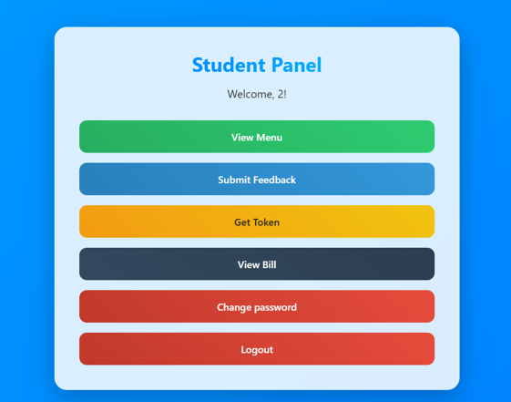
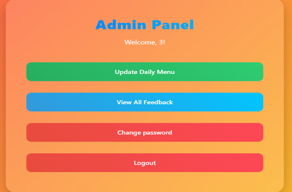
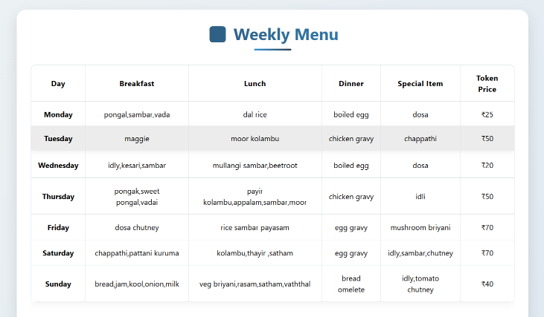
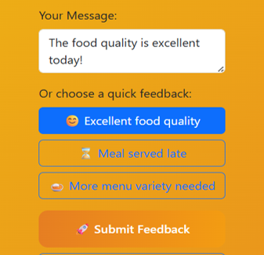
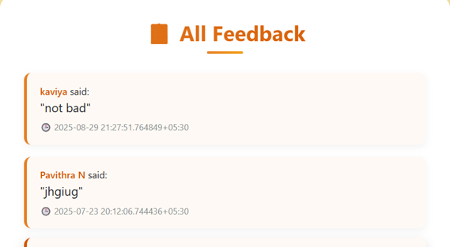
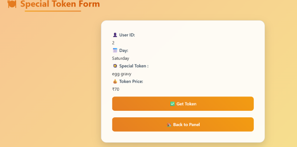
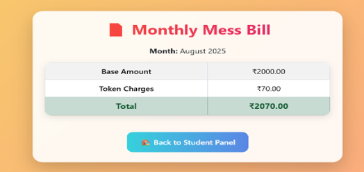

# Mess-Management-System
A complete hostel mess management web application developed using FastAPI, PostgreSQL, HTML, CSS, JavaScript, and Jinja2 Templates.

---
# Project Overview

The Mess Management System is designed to simplify and digitize hostel mess operations for both students and administrators.
This system helps manage daily mess activities efficiently through a centralized web platform.

Students can:

- View daily menus
- Submit feedback
- Apply for special food tokens
- View monthly mess bills
- Change passwords securely

Administrators can:

- Manage daily menus
- View student feedback
- Issue tokens
- Update student bills
- Manage users

---

# Features

## Student Module

- Secure Login Authentication
- View Daily Menu
- Submit Feedback
- Apply for Special Tokens
- View Monthly Bills
- Change Password

---

## Admin Module

- Add / Update Daily Menu
- View Student Feedback
- Issue Special Tokens
- Update Student Bills
- User Management

---

# Technologies Used

- Python
- FastAPI
- PostgreSQL
- HTML5
- CSS3
- JavaScript
- Jinja2 Templates
- Alembic

---

# Project Structure

```plaintext
Mess-Management-System/
│
├── app/
├── templates/
├── static/
├── screenshots/
├── alembic/
├── README.md
├── requirements.txt
├── .gitignore
└── alembic.ini
```

---

# Project Screenshots

## Login Page


---

## Dashboard





---

## 🍽️ Daily Menu



---

## 📝 Feedback System





---

## 🎟️ Token System



---

## 💰 Monthly Bill



---

# 🔮 Future Enhancements

- QR Code Payment Integration
- Mobile Application Support
- AI-Based Meal Prediction
- Notification System

---

# 👩‍💻 Developed By

**Pavithra N**  
BE Computer Science Engineering

---
